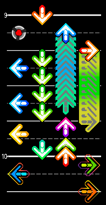

# Lemma's DDRainbow
 Improved DDR-Rainbow noteskins for Stepmania

I'm not satisfied with the standard DDR Rainbow noteskin for Stepmania. It only has distinct quantizations for quarters and eighths, it uses a recolor of the ITG-style roll, and it's just generally not much more than the bare minimum of Looking Like A DDR Noteskin. That's why I decided to do something about it

## Features
- Full suite of standard quants - 4th, 8th, 16th, 32nd, triplet, and unquantized
- Custom directional roll textures - no more ITG roll
- Quantized lifts based off [Peter's Noteskins](https://github.com/Pete-Lawrence/Peters-Noteskins)
- Opaque receptors

## Versions
Currently I've made versions of the noteskin for Stepmania 5/ITGMania, with a standard and reverse variant. Sadly, due to how noteskins work, it isn't really feasible to have a single noteskin support both at the same time while still looking good. There might be a way to do it but I'll have to keep looking. I'm also planning to make a NotITG variant soon!

There are also colorblind-friendly versions, which should be more readable for people protanopia, deuteranopia, or tritanopia. Let me know if there's anything I can do to improve them!

## Installation
Just like any other noteskin, drop the folders for your game version into `NoteSkins/dance` inside the game directory. Enjoy!

## Future Plans (may not be implemented, depends on my energy)
- NotITG variant
- Custom mine
- Figure out some way to make the noteskins work bidirectionally
- Solo rolls